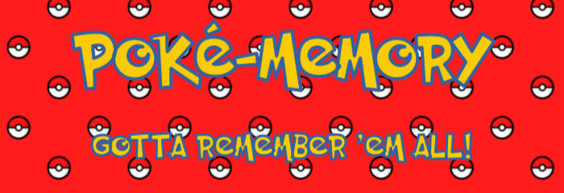
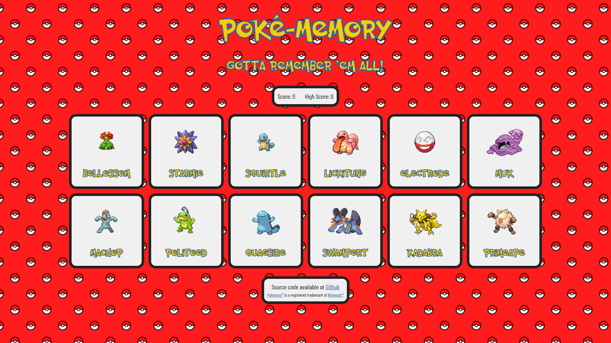

<!-- PROJECT LOGO -->
 

  

<h3 align="center">Poké-Memory</h3>

  

    Learning project as part of The Odin Project's curriculum. 
     
     
    <a href="https://odincards.netlify.app/">View Demo</a>
  

<!-- TABLE OF CONTENTS -->

  
Table of Contents

  <ol>
    <li>
      <a href="#about-the-project">About The Project</a>
      <ul>
        <li><a href="#built-with">Built With</a></li>
      </ul>
    </li>
    <li><a href="#license">License</a></li>
    <li><a href="#acknowledgments">Acknowledgments</a></li>
  </ol>

<!-- ABOUT THE PROJECT -->
## About The Project

Poké-Memory is a simple game made with React as part of the curriculum presented by [The Odin Project](https://www.theodinproject.com/), specifically for [the Memory Card project](https://www.theodinproject.com/lessons/node-path-react-new-memory-card). The game itself consists of attempting to click each image only once and uses the [Pokémon API](https://pokeapi.co/) as a source of random images.

(<a href="#readme-top">back to top</a>)

### Built With

[![React][React.js]][React-url]

(<a href="#readme-top">back to top</a>)

<!-- LICENSE -->
## License

Distributed under the MIT License. See `LICENSE.txt` for more information.

(<a href="#readme-top">back to top</a>)

<!-- ACKNOWLEDGMENTS -->
## Acknowledgments

* [Best Readme Template](https://github.com/othneildrew/Best-README-Template): provider of the template used to write this project's Readme document
* [Nintendo Company](https://www.nintendo.com): the rightful owner of the Pokémon trademark

(<a href="#readme-top">back to top</a>)

<!-- MARKDOWN LINKS & IMAGES -->
[product-screenshot]: images/screenshot.png
[React.js]: https://img.shields.io/badge/React-20232A?style=for-the-badge&logo=react&logoColor=61DAFB
[React-url]: https://reactjs.org/
